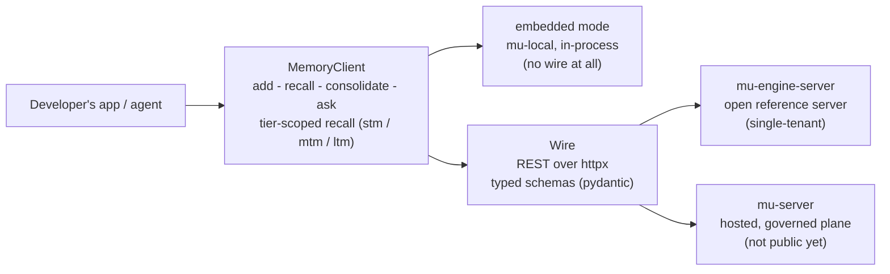

# mu-sdk-python

The Python developer SDK: a typed async client for the Memory Universe wire contract.

Part of [Memory Universe](https://github.com/MemoryUniverse).

**The Python developer SDK for Memory Universe.** A thin, typed, async wire client for adding,
recalling, and reasoning over memory — for anyone building their own agent, tool, or product on
Memory Universe rather than using Claude Code or Codex directly.

> **Status: early, under active development.** The SDK itself is built, typed, and tested (unit
> plus a real-HTTP conformance suite, no mocks), and is used internally to drive real LangGraph
> agents end to end. The hosted, governed, multi-tenant plane (`mu-server`) it
> is ultimately aimed at is **not public**. What you *can* point it at today is the open, dockerized
> `mu-engine-server` in [`mu-core`](https://github.com/MemoryUniverse/mu-core), or run the engine
> in-process with the `embedded` extra. A private beta has **not started** — design partners are
> being recruited for one. See
> [Built vs. designed](#built-vs-designed-read-this-before-you-evaluate-it).

## The vision

Memory Universe is the persistent collaborative session and memory layer for teams of people and
their AI agents — across users, devices, agents, and vendors: context that survives the handoff
between sessions, teammates, machines and vendors, and travels only as far as it was authorized to.
`mu-sdk-python` is the developer surface of that vision — the SDK you reach for when you are
building your *own* agent product and want memory, with governance, provenance, and per-fragment
sharing, as infrastructure rather than something you build in-house.

## What's in this repo

A wire client, and by default nothing else: no engine, no stores, no strategies, no embedder. The
default install depends only on `mu-contracts` (from `mu-core`) for the shared vocabulary —
namespaces, visibility, error types — and speaks to a Memory Universe server's public surface over
**REST**, using `httpx`.

REST is the *only* transport in this repo today. The wider design also gives the SDK an MCP surface
(the same operations as agent-framework tools) and a Centrifugo channel for live push; neither is
implemented here — there is no MCP module and no push client in `src/mu_sdk/`, and the only "mcp"
strings in the package are references to the spec filename. Treat both as designed, not available.

Two things are worth knowing beyond that:

- **`mode` picks the transport, not a different product.** `SdkConfig.mode` is
  `"embedded" | "local_server" | "remote"`. `"local_server"` and `"remote"` speak HTTP;
  **`"embedded"` has no wire at all** — installing the `embedded` extra pulls in `mu-local` and runs
  `mu-core`'s real engine in your process, behind the same verbs. The import is lazy, so the default
  install still carries no engine.
- **The plane gate is shared, not reimplemented.** Private-plane kwargs (`user`, `session`, `agent`)
  and shared-plane kwargs (`visibility`, `subject`, `predicate`, `object`) are validated by one
  validator living in `mu-contracts`, so `MemoryClient` and `mu-core`'s `LocalMemory` enforce the
  same rule. Supplying a field that does not apply to the configured plane is a named rejection, not
  a silent no-op.

`MemoryClient` exposes:

| Verb | What it does | Server route today |
|---|---|---|
| `add(content, ...)` | Write a memory (a `PRIVATE` write to the shared endpoint is rejected server-side, so there is no accidental leak path) | yes |
| `recall(text, ...)` | The richer, multi-channel read: persona-aware, tier-scoped (`stm`/`mtm`/`ltm`), channel-selectable | yes |
| `get(memory_id, ...)` | Fetch one memory by id | yes |
| `consolidate(...)` | Trigger MTM→LTM distillation: extract bi-temporal facts, apply invalidate-don't-delete supersession | yes |
| `promote` / `demote` | Move one memory between tiers | yes |
| `update(memory_id, ...)` | Supersede a memory (invalidate-don't-delete: the old id stays traversable) | yes |
| `delete(memory_id, ...)` | Retire a memory | yes |
| `build_context(text, ...)` | Assemble a context window over recalled memory | yes |
| `search(query, ...)` | Simple ranked-list recall (the mem0-style muscle-memory name) | **not yet** — conformance server only |
| `ask(question, ...)` | Synthesize an answer over recalled context (raises a typed error rather than faking a degraded answer if no model is configured) | **not yet** — conformance server only |
| `context.discover(session_id)` | Discover the context index for a session | **not yet** — conformance server only |
| `share(memory_id, ...)` | The explicit private→shared crossing | **not yet** — conformance server only; no production route anywhere |

Every call goes through one retry/timeout/trace decorator stack, with typed errors mapped from wire
responses. `asyncio.CancelledError` always propagates untouched, never swallowed by a broad except.

## Quickstart

`mu-sdk-python` is not on PyPI yet (the package name will be `mu-sdk`), and its `mu-contracts`
dependency is currently a relative path dependency onto the sibling `mu-core` repo rather than a
published version — an honest rough edge of pre-release, multi-repo development. For now:

```bash
git clone https://github.com/MemoryUniverse/mu-core
git clone https://github.com/MemoryUniverse/mu-sdk-python
cd mu-sdk-python
uv sync --extra dev
```

The client needs something that speaks the Memory Universe wire contract, and a credential for it.
The shortest real path to both is `mu-core`'s open reference server, which mints a local bearer
token for you:

```bash
cd mu-core/packages/mu-engine-server
make up          # mints ~/.memory-universe/engine-server.token, then brings the stack up on :8300
```

Use `make up`, not a bare `docker compose up`: every route but `/health` is bearer-authenticated,
and `mint-token` is a prerequisite of `up`. Skipping it gets you a healthy server that `401`s
everything.

Then point the SDK at it. `mode="local_server"` auto-loads that token from disk, so this needs no
credential wiring of its own:

```python
import asyncio
from mu_sdk import MemoryClient, SdkConfig

async def main() -> None:
    config = SdkConfig(mode="local_server", endpoint="http://localhost:8300")
    async with MemoryClient(config=config) as client:
        await client.add("The staging DB migration runs Tuesdays at 02:00 UTC.")
        result = await client.recall("when does the migration run?")
        for item in result.items:
            print(item.score, item.content)

asyncio.run(main())
```

Constructing with a bare `SdkSettings(base_url=...)` and no credential is the one shape that does
**not** work: `resolve_auth` raises `AuthenticationError` in the constructor, before any request.
That is deliberate (fail loud at construction), but it means `api_key=` or a complete `identity=`
is mandatory on that path.

Or skip the wire entirely and run the engine in-process:

```bash
uv sync --extra embedded   # pulls in mu-local -> mu-engine
```

## Built vs. designed: read this before you evaluate it

- **Built and tested today:** the whole client — transport, retry/timeout/trace pipeline, typed
  error mapping, pydantic request/response models — exercised by unit tests plus a real-HTTP
  conformance suite (a genuine FastAPI app under a real uvicorn, no mocks) that
  [`mu-sdk-js`](https://github.com/MemoryUniverse/mu-sdk-js) runs against too, with payload parity
  asserted rather than assumed. Internal LangGraph demo agents use this exact client.
- **Runnable today:** the verbs marked *yes* above, against `mu-core`'s open, dockerized
  `mu-engine-server`, or in-process via the `embedded` extra.
- **Client-side only, for now:** `search`, `ask`, and `context.discover` are implemented and typed
  here and are served by the conformance server, but no production server route pins them yet. They
  will raise against `mu-engine-server`.
- **Typed here, served by nothing:** `share`, the private→shared crossing. The client method is
  real (`client.py`, `POST /v1/memories/{id}/share`) and the conformance server answers it, but no
  production server does: `mu-core`'s engine facade raises a named
  `SurfaceVerbNotImplementedError` rather than pretending, and neither `mu-engine-server` nor
  `mu-server` exposes the route. The crossing belongs to `mu-server`, which is not public.
- **Designed, not built in this repo:** the MCP tool surface and the Centrifugo live-push channel.
  The client is REST-only today.
- **Designed, not shipped:** the hosted, governed, multi-tenant plane itself — governed rooms,
  per-fragment provenance, revocable grants, cross-device sync. Nothing in this repo should be read
  as implying it is available.

## Architecture, in one paragraph



`MemoryClient` wraps an `httpx`-based `Transport` behind a fixed pipeline: trace, then an overall
wall-clock timeout generous enough to cover every retry attempt, then bounded retry with backoff, so
every public verb funnels through one request choke-point that raises a typed SDK error on any
non-2xx response before the retry logic ever sees it. Request and response bodies are pydantic
models mirrored field for field by `mu-sdk-js`'s zod schemas, so the two SDKs stay provable mirrors
of one wire contract rather than independently-maintained guesses.

## Where this fits

Part of **Memory Universe**: [github.com/MemoryUniverse](https://github.com/MemoryUniverse).

| Repo | Role |
|---|---|
| [`mu-core`](https://github.com/MemoryUniverse/mu-core) | The open engine: contracts, engine, local facade, reference HTTP server |
| [`mu-client`](https://github.com/MemoryUniverse/mu-client) | The on-device daemon: hook capture for Claude Code and Codex, injection, CLI, MCP |
| **mu-sdk-python** (this repo) | Python developer SDK: typed wire client, plus an in-process embedded mode |
| [`mu-sdk-js`](https://github.com/MemoryUniverse/mu-sdk-js) | JavaScript/TypeScript developer SDK, wire-parity with this one |
| `mu-server` (private) | The hosted, governed, multi-tenant plane: the commercial part |

## License

Apache-2.0 (see `LICENSE`). Open-core: this SDK, `mu-core`, and `mu-client` are fully open and stay
full-quality. `mu-server`, the hosted, multi-tenant, governed plane, is the commercial product built
on top; it does not exist in this repo and is not required to read or build this code.

## Background

Memory Universe is independent, early-stage work: the productization of about a year of the
founder's graduation-thesis research into multi-user agentic memory. No company and no customers
yet — just an engineer building the open memory layer he believes agent-building teams will need, in
public.

## Contact

- GitHub: [@TRextabat](https://github.com/TRextabat)
- Email: amiramiritabat01@gmail.com

## Links

- Organization: [github.com/MemoryUniverse](https://github.com/MemoryUniverse)
- Issues / discussion: use this repo's GitHub Issues
- License: [Apache-2.0](./LICENSE)
