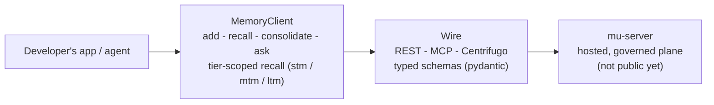

# mu-sdk-python

**The Python developer SDK for Memory Universe.** A thin, typed, async wire client for adding,
recalling, and reasoning over memory, for anyone building their own agent, tool, or product on top
of Memory Universe rather than using Claude Code or Codex directly.

> **Status: early, under active development (private beta in progress).** The SDK itself is built,
> typed, tested (unit + real-HTTP conformance suite, no mocks), and used internally to drive
> real LangGraph agents end to end. What it talks to, `mu-server`, the hosted, governed, multi-
> tenant plane, is designed but **not yet publicly available**. See [Honest note on what you can
> run today](#honest-note-on-what-you-can-run-today).

## The vision

Memory Universe is a persistent, governed context layer for teams of people and their AI agents:
context that survives across sessions, teammates, machines, and agent vendors, and travels only as
far as it was authorized to. `mu-sdk-python` is the Product-B surface of that vision: the SDK a
developer reaches for when they're building their *own* agent product and want memory (with
governance, provenance, and per-fragment sharing) as infrastructure rather than something they
build in-house.

## What's in this repo

`mu-sdk-python` is a wire client, nothing else: no engine, no stores, no strategies, no embedder.
It depends only on `mu-contracts` (from `mu-core`) for the shared vocabulary (namespaces,
visibility, error types) and speaks to `mu-server`'s public surface through REST, MCP (so an agent
framework can call the same operations as tools), and Centrifugo for live push.

`MemoryClient` exposes:

| Verb | What it does |
|---|---|
| `add(content, ...)` | Write a memory (rejects a `PRIVATE` write to the shared endpoint server-side, so there's no accidental leak path) |
| `search(query, ...)` | Simple ranked-list recall (the mem0-style muscle-memory name) |
| `recall(text, ...)` | The richer, multi-channel read: persona-aware, tier-scoped (`stm`/`mtm`/`ltm`), channel-selectable |
| `consolidate(...)` | Trigger MTM→LTM distillation: extract bi-temporal facts, apply invalidate-don't-delete supersession |
| `ask(question, ...)` | Synthesize an answer over recalled context (raises a typed error rather than faking a degraded answer if no model is configured) |
| `context.discover(session_id)` | Discover the context index for a session |

Every call goes through one retry/timeout/trace decorator stack, with typed errors mapped from wire
responses. `asyncio.CancelledError` always propagates untouched, never swallowed by a broad except.

## Quickstart

`mu-sdk-python` isn't on PyPI yet (the package name will be `mu-sdk`), and its `mu-contracts`
dependency is currently a relative path dependency onto the sibling `mu-core` repo rather than a
published version, an honest rough edge of pre-release, multi-repo development. For now:

```bash
git clone https://github.com/MemoryUniverse/mu-core
git clone https://github.com/MemoryUniverse/mu-sdk-python
cd mu-sdk-python
uv sync --extra dev
```

```python
import asyncio
from mu_sdk import MemoryClient, SdkSettings

async def main() -> None:
    async with MemoryClient(settings=SdkSettings(base_url="http://localhost:8000")) as client:
        await client.add("The staging DB migration runs Tuesdays at 02:00 UTC.")
        result = await client.recall("when does the migration run?")
        for item in result.items:
            print(item.score, item.content)

asyncio.run(main())
```

### Honest note on what you can run today

`base_url` above has to point at something speaking `mu-server`'s wire contract. The public, hosted
`mu-server` is not open yet; it's the part of Memory Universe still in private beta. What exists
today: a real conformance HTTP server this SDK is tested against (byte-for-byte, alongside
`mu-sdk-js`, so both SDKs are provably wire-compatible), and internal LangGraph demo agents that use
this exact client against a local reference server backed by `mu-core`'s engine. If you want to use
`mu-sdk-python` for real right now, the practical path is running your own server that implements
the same contract (`mu-core`'s `mu-engine` is the open reference implementation), or waiting for
the hosted plane's private beta.

## Architecture, in one paragraph



`MemoryClient` wraps an `httpx`-based `Transport` behind a fixed pipeline: trace, then an overall
wall-clock timeout that's generous enough to cover every retry attempt, then bounded retry with
backoff, so every public verb funnels through one request choke-point that raises a typed SDK
error on any non-2xx response before the retry logic ever sees it. Request/response bodies are
pydantic models shared conceptually with `mu-sdk-js`'s zod schemas, so both SDKs stay provable
mirrors of the same wire contract rather than independently-maintained guesses.

## License

Apache-2.0 (see `LICENSE`). Open-core: this SDK, `mu-core`, and `mu-client` are fully open and stay
full-quality. `mu-server`, the hosted, multi-tenant, governed plane this SDK talks to, is the
commercial product built on top; it doesn't exist in this repo and isn't required to read or build
this code.

## Background

Memory Universe is independent, early-stage work: the productization of about a year of the
founder's graduation-thesis research into multi-user agentic memory. No company and no customers
yet. Just an engineer building the open memory layer he believes agent-building teams will need, in
public.

## Contact

- GitHub: [@TRextabat](https://github.com/TRextabat)
- Email: amiramiritabat01@gmail.com

## Links

- Organization: [github.com/MemoryUniverse](https://github.com/MemoryUniverse)
- Sibling repos: [`mu-core`](https://github.com/MemoryUniverse/mu-core) ·
  [`mu-client`](https://github.com/MemoryUniverse/mu-client) ·
  [`mu-sdk-js`](https://github.com/MemoryUniverse/mu-sdk-js) (TypeScript/JavaScript, feature parity)
- Issues / discussion: use this repo's GitHub Issues
- License: [Apache-2.0](./LICENSE)
